```bash
enable
config
no spanning-tree vlan 1
```


上1下2

1

去掉vid 打vid2


2 正确

直接转发 正确


上2 下1

直接转发 正确


区队vid 打vid1 错误


## 划分vlan


查看端口状态，现在所有端口都在vlan1

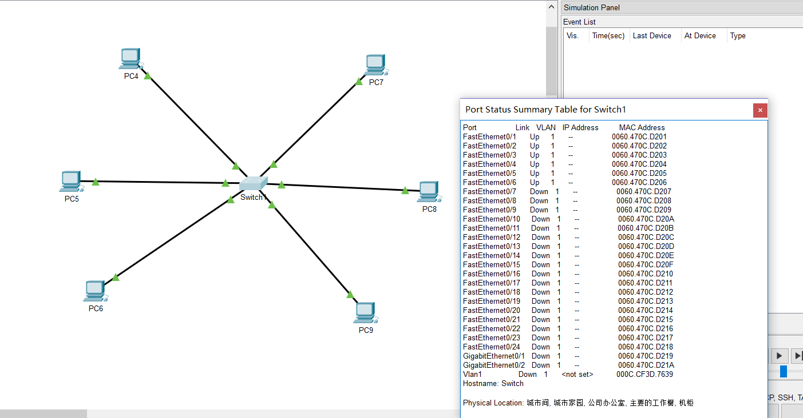


左边3台设置一个vlan 右边3台设置一个VLAN2

1. 新建vlan

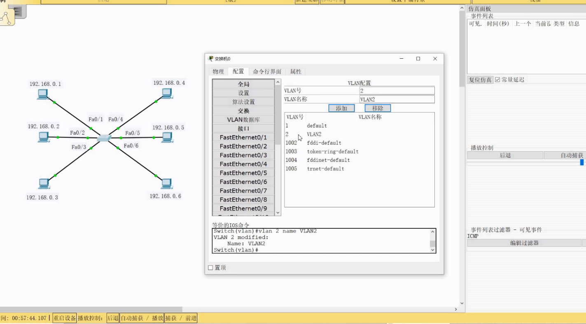

2. 设置端口为vlan2

   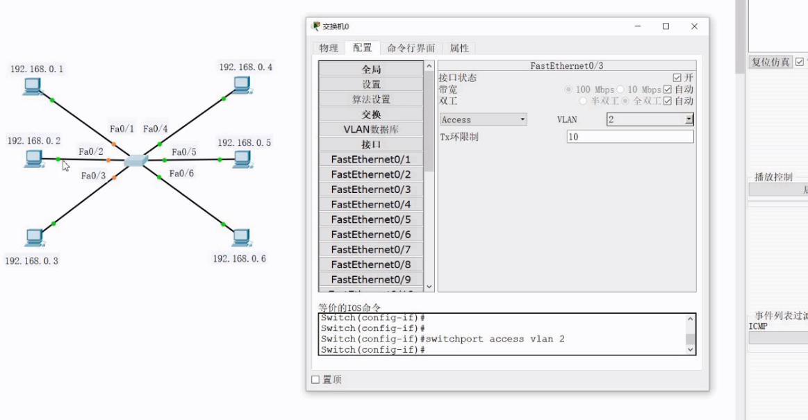


命令行创建

```bash
enable
config
# 创建vlan 3

Switch>
Switch>enable
Switch#config
Configuring from terminal, memory, or network [terminal]? 
Enter configuration commands, one per line.  End with CNTL/Z.
Switch(config)#vlan 3
Switch(config-vlan)#name VLAN3
Switch(config-vlan)#end
Switch#show vlan brief

VLAN Name                             Status    Ports
---- -------------------------------- --------- -------------------------------
1    default                          active    Fa0/4, Fa0/5, Fa0/6, Fa0/7
                                                Fa0/8, Fa0/9, Fa0/10, Fa0/11
                                                Fa0/12, Fa0/13, Fa0/14, Fa0/15
                                                Fa0/16, Fa0/17, Fa0/18, Fa0/19
                                                Fa0/20, Fa0/21, Fa0/22, Fa0/23
                                                Fa0/24, Gig0/1, Gig0/2
2    VLAN2                            active    Fa0/1, Fa0/2, Fa0/3
3    VLAN3                            active    
1002 fddi-default                     active    
1003 token-ring-default               active    
1004 fddinet-default                  active    
1005 trnet-default                    active    
Switch#config terminal
Enter configuration commands, one per line.  End with CNTL/Z.
Switch(config)#interface range fastethernet 0.4 -6
                                               ^
% Invalid input detected at '^' marker.
	
Switch(config)#interface range fastethernet 0/4 -6
Switch(config-if-range)#switchport mode access
Switch(config-if-range)#switchport access vlan 3 
Switch(config-if-range)#end 
Switch#show vlan brief

VLAN Name                             Status    Ports
---- -------------------------------- --------- -------------------------------
1    default                          active    Fa0/7, Fa0/8, Fa0/9, Fa0/10
                                                Fa0/11, Fa0/12, Fa0/13, Fa0/14
                                                Fa0/15, Fa0/16, Fa0/17, Fa0/18
                                                Fa0/19, Fa0/20, Fa0/21, Fa0/22
                                                Fa0/23, Fa0/24, Gig0/1, Gig0/2
2    VLAN2                            active    Fa0/1, Fa0/2, Fa0/3
3    VLAN3                            active    Fa0/4, Fa0/5, Fa0/6
1002 fddi-default                     active    
1003 token-ring-default               active    
1004 fddinet-default                  active    
1005 trnet-default                    active    
Switch#
```


### 实验2

12台主机，左边六台vlan2 右边vlan3


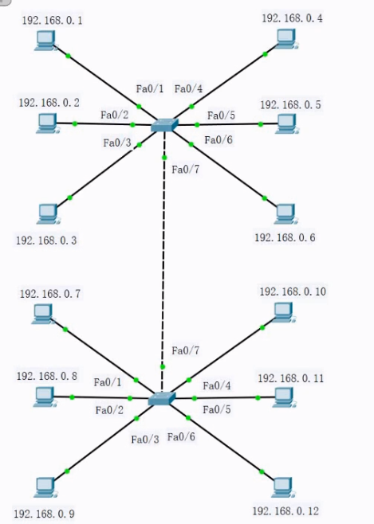


第一步， 设置 左边6台主机为vlan2 。右边为vlan3

第二步， 修改两个交换机的端口号为trunk类型

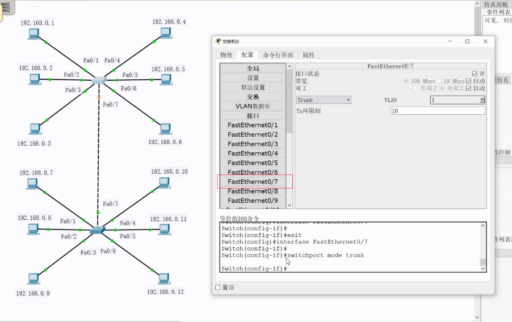


## 划分子网

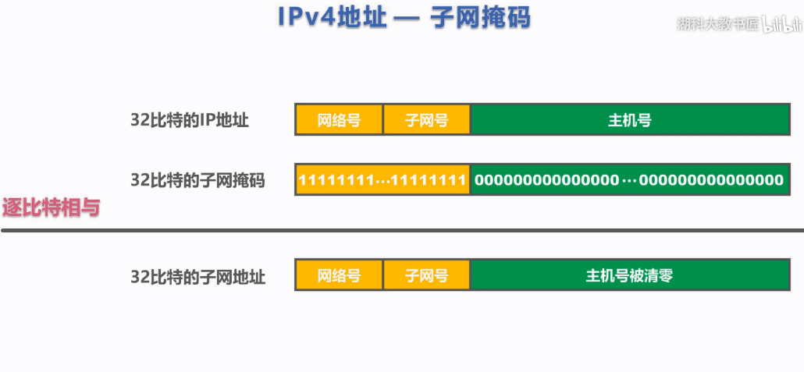

子网掩码就是与ip地址相与的


### 默认子网掩码

A类地址 默认子网掩码255.0.0.0

B类地址       255.255.0.0

C                   255.255.255.0


#### C网可用子网掩码

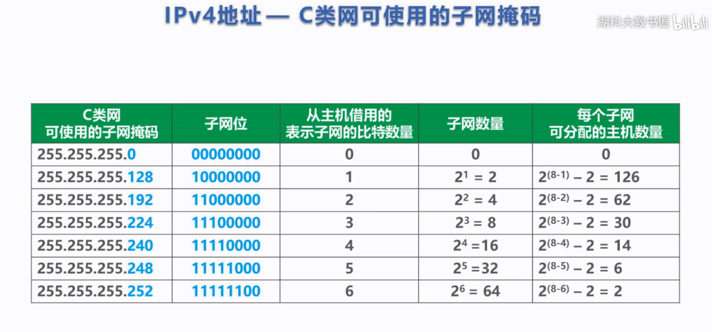


### 习题

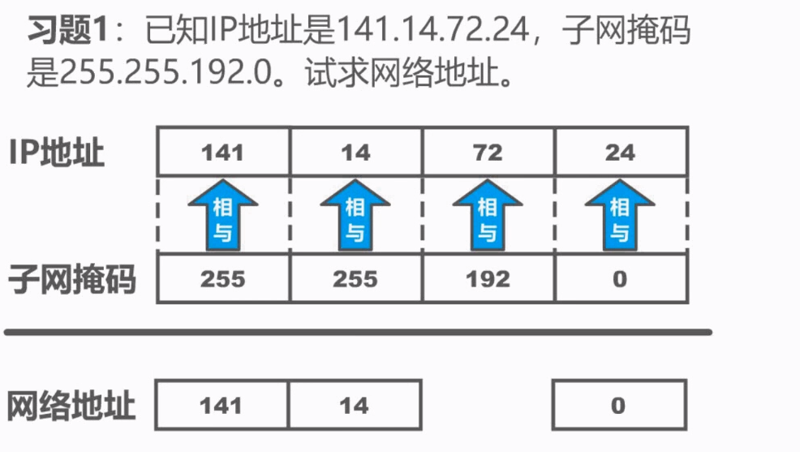


128 64 32 16 8 4 2

141.14[0100 1000]

1111 1111 1111 1111 1100 0000

141.14.64.0.0

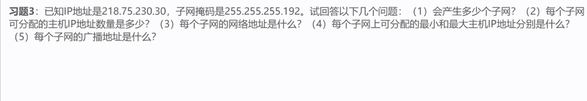

218.75.230.[0001 1110]

​             192[1100 0000]


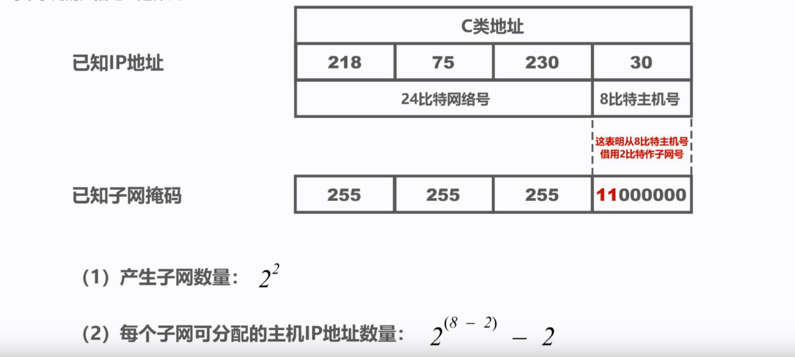


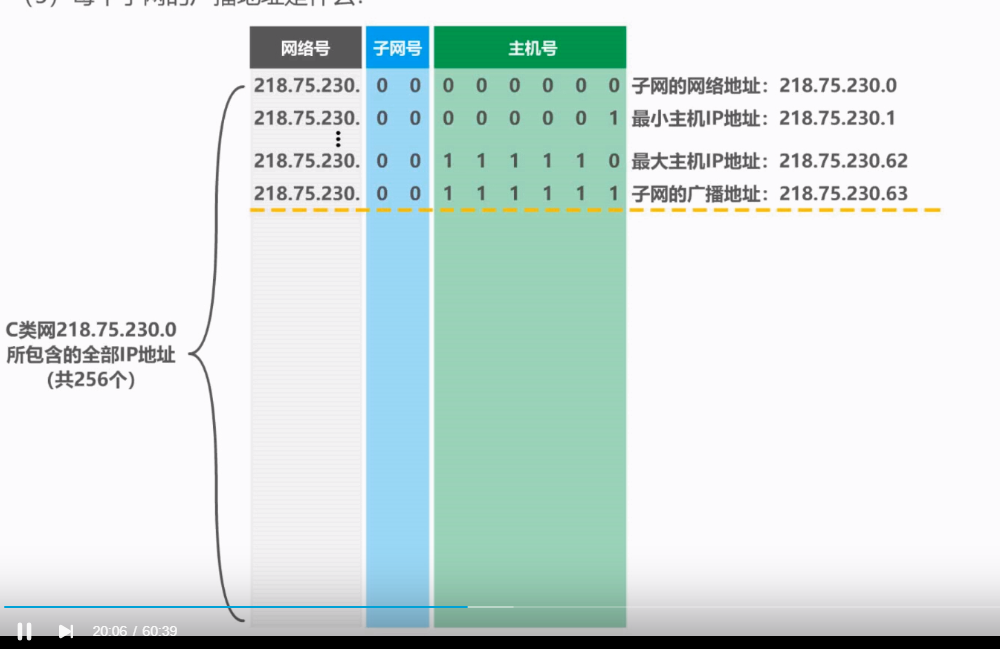

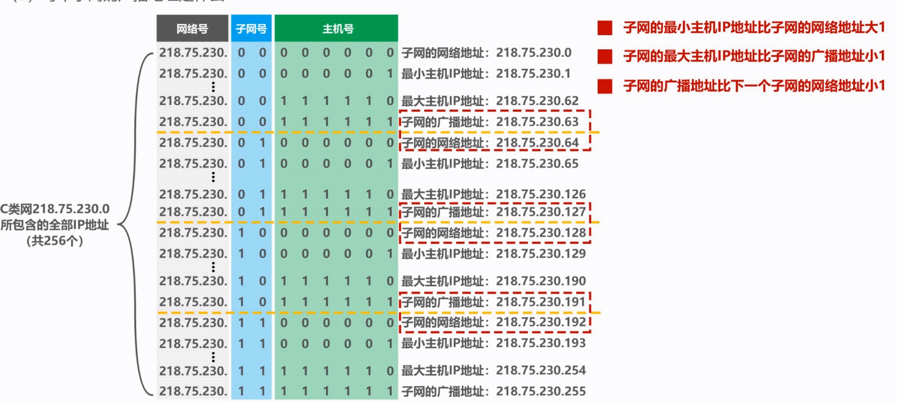


## 构造超网


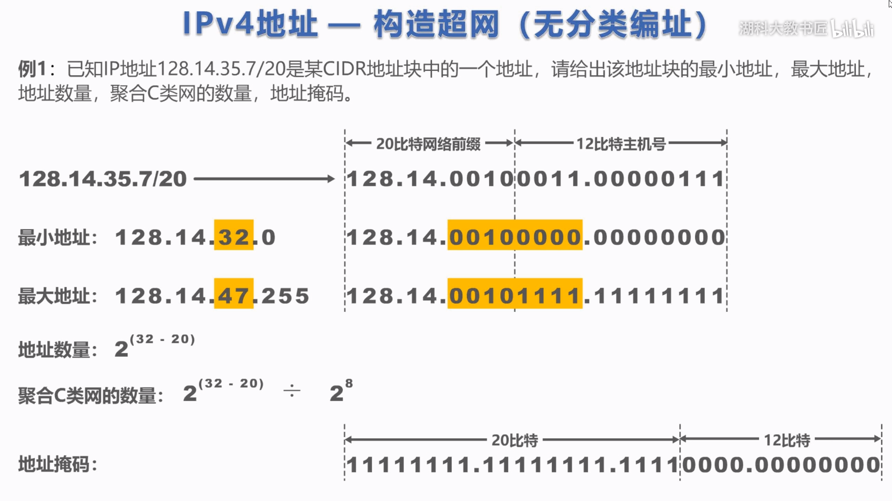

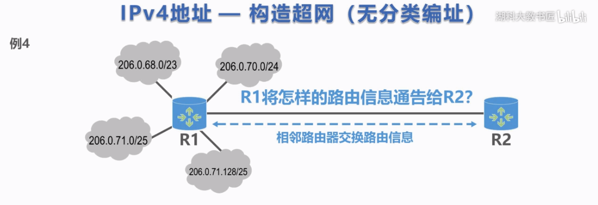


206.0.68.0  /23              206.0.[0100 0100].[0000 0000]

206.0.70.0  /24              206.0.[0100 0110].[0000 0000]

206.0.71.0  /25			  206.0.[0100 0111].[0000 0000]

206.0.71.128/25			206.0.[0100 0111].[1000 0000]


聚合地址块 206.0.68.0/22


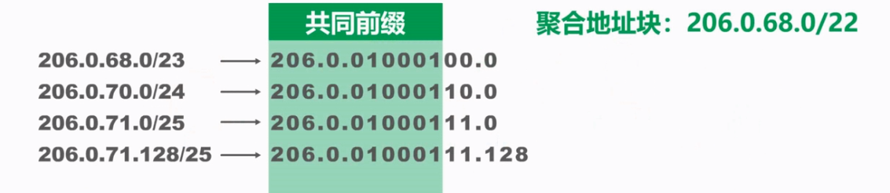


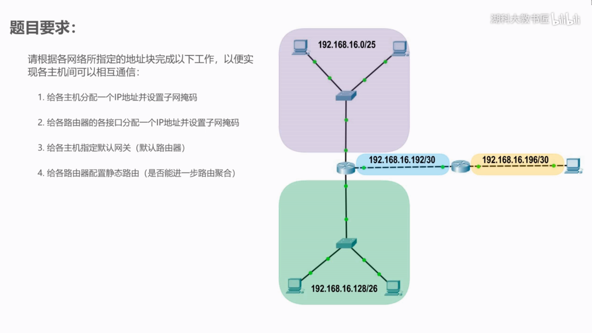

192.168.16.0/25               192.168.16.[<strong>0</strong> 000  0000]

最小地址： 192.168.16.0

最大地址：192.168.127

可分配地址：192.168.16.1 ~ 192.168.126

地址掩码：255.255.255.[1000  0000]   => 255.255.255.128 


192.168.16.128/26   => 192.168.16.[<strong>10</strong>00 0000]

最小地址： 192.168.16.128

最大地址：192.168.16.191

可分配地址：192.168.16.129 ~ 192.168.16.190 

地址掩码：255.255.255.[1100 0000] => 255.255.255.192


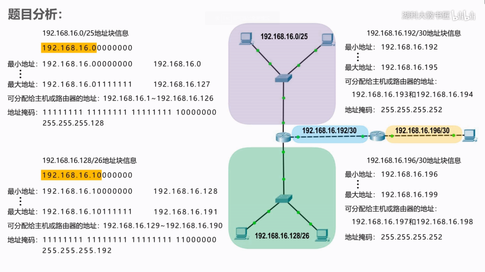


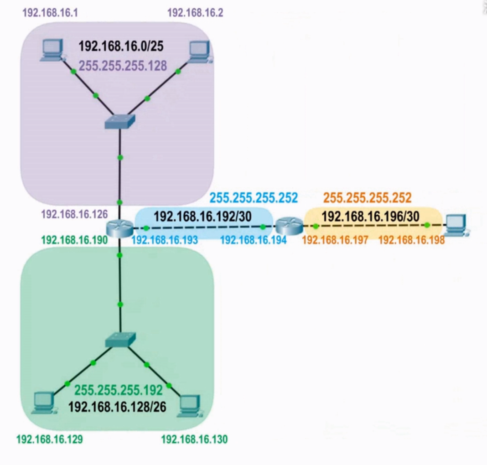


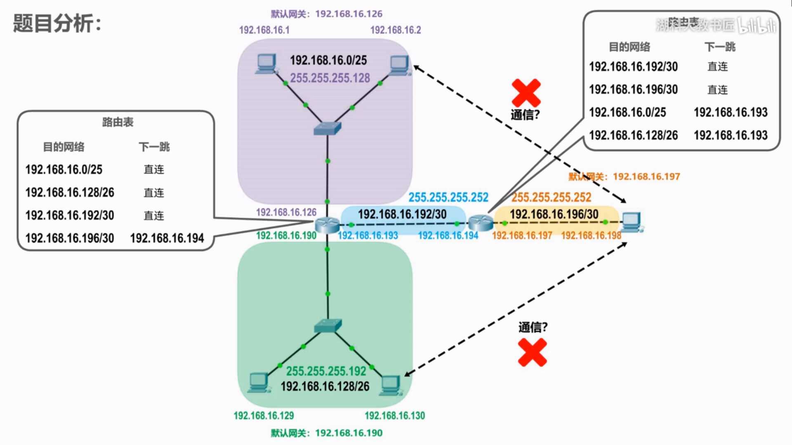


右侧网络可以聚合为192.168.16.0/24


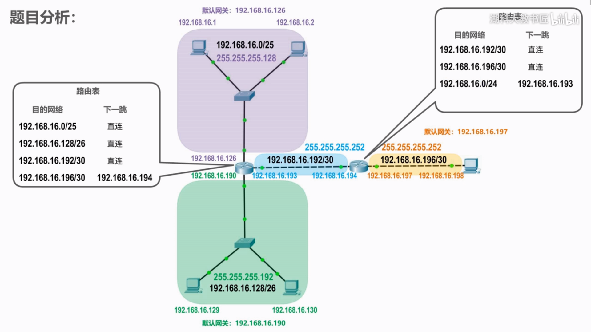


路由器选2911型号，不然接口不够用

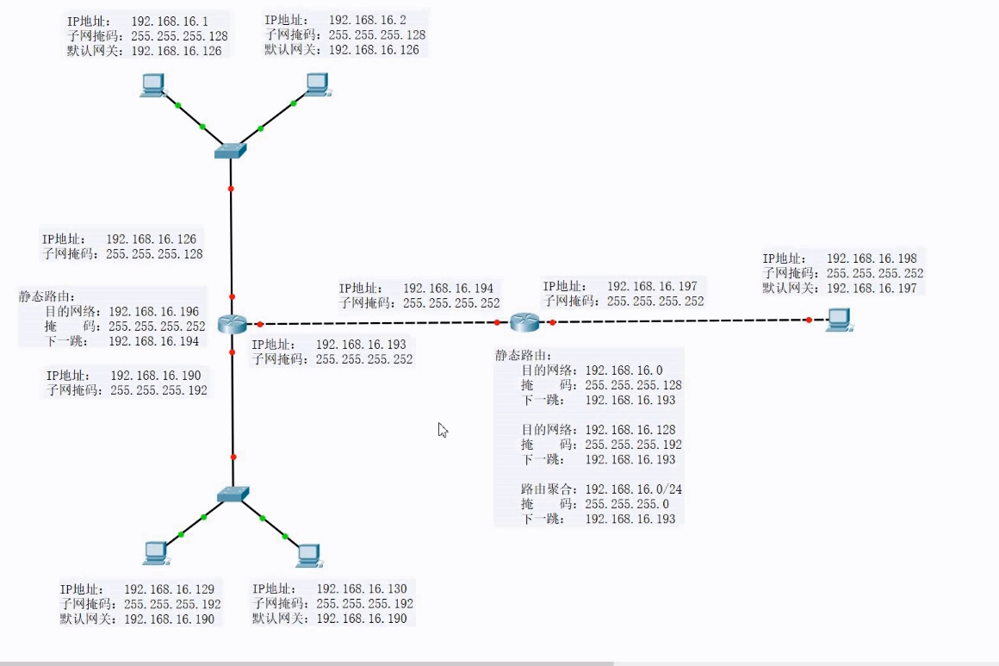


192.168.16.192/30

192.168.16.[1111 1100]

最大可分配网络


子网掩码 255.255.255.252